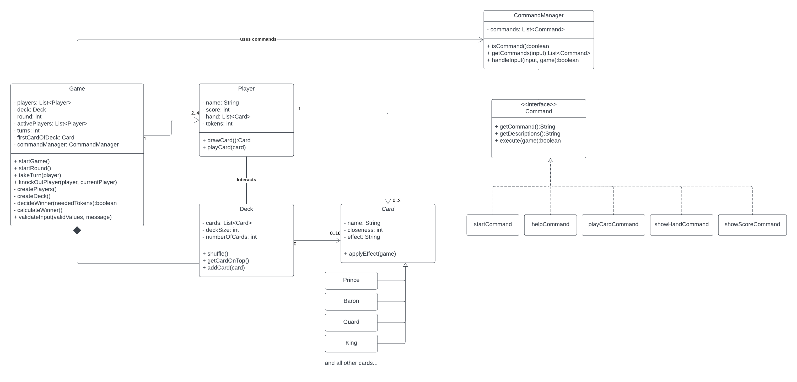

# Love Letters

Welcome to my implementation of the card game Love Letter by Seiji Kanai.
A project developed during the course SEP (Softwareentwicklungspraktikum) at the LMU.

## Table of contents

- [Game](#game)
  - [Rules](#rules)
- [Features and Specifications](#features-and-specifications)
  - [Mandatory Features](#mandatory-features)
  - [Additional Features](#additional-features)
- [How to run it](#how-to-run-it)
- [UML diagram](#uml-diagram)
- [Author](#author)

## 💌 Game
### Rules

#### Object of the Game

In the wake of the arrest of Queen Marianna for high treason, none was more heartbroken than her daughter, Princess Annette. Suitors throughout the City-State of Tempest sought to ease Annette's sorrow by courting her to bring some joy into her life.

You are one of these suitors, trying to get your love letter to the princess. Unfortunately, she has locked herself in the palace, so you must rely on intermediaries to carry your message.

During the game, you hold one secret card in your hand. This is who currently carries your message of love for the princess.

Make sure that the person closest to the princess holds your love letter at the end of the day, so it reaches her first!

#### Game Play

Love Letter is played in a series of rounds. Each round represents one day. At the end of each round, one player's letter reaches Princess Annette, and she reads it.

When she reads enough letters from one suitor, she becomes enamored and grants that suitor permission to court her. That player wins the princess's heart and the game.

#### Taking a Turn

On your turn, draw the top card from the deck and add it to your hand. Then choose one of the two cards in your hand and discard it face up in front of you. Apply any effect on the card you discarded. You must apply its effect, even if it is bad for you.

All discarded cards remain in front of the player who discarded them. Overlap the cards so that it's clear in which order they were discarded. This helps players to figure out which cards other players might be holding.

Once you finish applying the card's effect, the turn passes to the player on your left.

#### Out of the Round

If a player is knocked out of the round, that player discards the card in his or her hand face up (do not apply the card's effect) and takes no more turns until next round.

#### Honesty

A player could cheat when chosen with the Guard, or fail to discard the Countess when that player has the King or Prince in hand. We suggest that you don't play with knaves who cheat at fun, light games.

#### End of a Round

A round ends if the deck is empty at the end of a turn. The royal residence closes for the evening, the person closest to the princess delivers the love letter, and Princess Annette retires to her chambers to read it.

All players still in the round reveal their hands. The player with the highest ranked person wins the round. In case of a tie, the player who discarded the highest total value of cards wins.

A round also ends if all players but one are out of the round, in which case the remaining player wins.

The winner receives a token of affection. Shuffle all 16 cards together, and play a new round following all of the setup rules.

The winner of the previous round goes first, because the princess speaks kindly of him or her at breakfast.

#### End of the game

A player wins the game after winning a number of tokens based on the number of players:

- 2 players - 7 tokens
- 3 players - 5 tokens
- 4 players - 4 tokens

## 📋 Features and specifications 

### Mandatory features
- Various **commands** have to be implemented.   
    (help, start, showHand, showScore, playCard)
- Users have to be able to choose the **number of players**
### Additional features
- ~~Other Commands~~
- ~~Colorful Console Output~~

## 🚀 How to run it 

**Prerequisites:** you have to have Java installed on your computer (developed in Java 19).

## 📉 UML diagram 

Here you can see the most recent UML diagram for my code. 

You can also check out [previous versions](src/main/resources/UML-diagrams) of the diagram.  
_(src/main/resources/UML-diagrams)_

## 👩‍💻 Author 
Annalisa Comin
- [GitHub](https://github.com/Annalisa11)
- [Instagram](https://www.instagram.com/annalisa_comin/)

